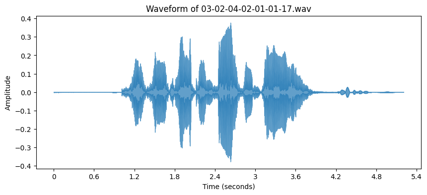
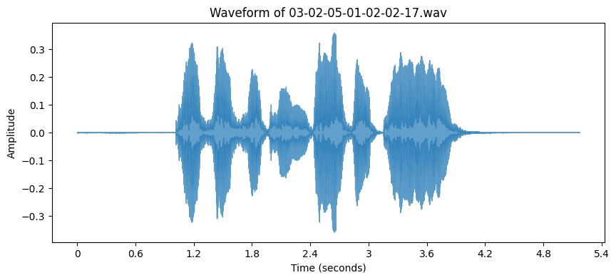

# Emotion Detection: Angry or Calm

This project aims to detect whether a person is angry or calm based on audio features using two machine learning algorithms:
- Logistic Regression
- Naive Bayes

## Project Description

This program processes audio data to extract features and then applies both Logistic Regression and Naive Bayes classifiers to determine the emotional state of a person. It classifies audio input as either "Angry" or "Calm" based on patterns learned from the features.

# Example of Angry Signal!

# Example of Calm Signal!

## How It Works

1. **Data Collection:** The dataset consists of audio recordings labeled as either "angry" or "calm."
2. **Feature Extraction:** Audio features are extracted from the recordings, such as pitch, tone, and volume.
3. **Model Training:** The features are used to train two different models:
    - Logistic Regression
    - Naive Bayes
4. **Prediction:** The trained models are used to classify new audio samples into one of the two categories.

